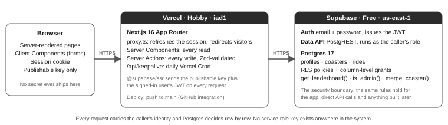
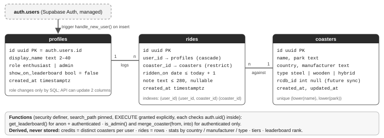

# Credit Count — Technical Design Document

| **Author** | Javier Arias | **Date** | 11 September 2026 |
|---|---|---|---|
| **Version** | 1.2 — as built. 1.0 (10 Sep 2026) was approved before any code; 1.1 recorded the build; 1.2 adds the diagrams, business rules and configuration after review. Changes since 1.0 in §8. | **Source** | *Credit Count — Statement of Work, Candidate Task*, Koin Limited, July 2026 |
| **Live** | credit-count-borosofo.vercel.app | **Code** | github.com/borosofo/credit-count |

## 1. Summary and design principle

Credit Count is a small multi-user web app where rollercoaster enthusiasts log rides against a shared catalogue and see their **credit count** (unique coasters ridden), total rides and stats, with an **opt-in** public leaderboard. Admins maintain the catalogue; visitors see only the leaderboard and sign-up. One principle drives the design: **the database is the security boundary.** Every privacy and role rule in the SOW is enforced with Postgres Row Level Security (RLS), grants and `security definer` functions, so it holds identically for the app, for direct API calls and for anything built later (FR6, FR8, FR9; AC2, AC4). The Next.js layer adds UX, validation and friendly errors; it is never the only line of defence.

## 2. Architecture

Next.js 16.3 (App Router, React 19, TypeScript, Tailwind v4, shadcn/ui, Zod, next-themes) on Vercel Hobby; Supabase Free for Auth, Postgres 17 and the SQL functions. There is no custom API layer and no service-role key anywhere: the app talks to Supabase with the publishable key plus the user's session via `@supabase/ssr`, and RLS decides what each request may read or write.

## 3. Data model

Credits and every stat are derived on read from `rides` joined to `coasters` by a pure, unit-tested `computeStats()`; no denormalised counter can drift, and every Server Action calls `revalidatePath`, so every view reflects a change immediately (FR3–FR5, FR7).

## 4. Access control

| Object | Visitor (anon) | Enthusiast (authenticated) | Admin |
|---|---|---|---|
| `profiles` | none | SELECT own row; UPDATE own row with a **column grant limited to `display_name`, `show_on_leaderboard`** (`role` is not writable through the API) | same as enthusiast |
| `coasters` | none | SELECT | SELECT + INSERT/UPDATE/DELETE where `(select is_admin())` |
| `rides` | none | ALL where `user_id = auth.uid()` (USING and WITH CHECK) | **no extra policy** — admins cannot read other users' rides (SOW §3) |
| `get_leaderboard()` | EXECUTE | EXECUTE | EXECUTE |
| `merge_coaster(from, into)` | — | raises unless admin | reassigns rides to the surviving coaster, deletes the duplicate |

- `is_admin()` is `security definer`, `stable`, with a fixed `search_path`, reading `profiles.role`: policies never recurse and a role change applies immediately, no JWT refresh.
- `get_leaderboard()` is the **only** path by which a visitor touches data. It returns `display_name`, `credits`, `rides` and `is_you` (true only on the caller's own row, computed from `auth.uid()` inside the function) for opted-in profiles; never user ids or coaster ids, so it cannot reveal what anyone has ridden (FR7).
- Default privileges for `anon` and `authenticated` are revoked and re-granted only as above; RLS is on for all three tables. The security advisor flags the `security definer` functions as callable: by design, each checks `auth.uid()` inside. Only the publishable key ships to the browser; the service-role key is never used (seed by SQL migration, every account through normal sign-up).

## 5. Business rules

- **Credit and rides.** A credit is a coaster the user has ridden at least once; rides count every logged row. Both are derived, never stored.
- **Tiers** by credits: Rookie 1 · Thrill Seeker 5 · Coaster Hunter 10 · Track Legend 25 · Century Club 50; the dashboard shows the current tier and progress to the next.
- **Leaderboard.** Opt-in, off by default; opting out removes the row on the next request. Ranked by credits, then rides, then display name; opted-in users with zero credits appear. Shows display name, credits, rides, tier and whether the row is yours, nothing else.
- **Admin** is a flag on a normal account, granted only by SQL; admins can log their own rides and never see other users' rides.
- **Catalogue.** Name + park unique, case-insensitive. A coaster with rides cannot be deleted, only merged into another: its rides move, credits recount. Types: steel, wooden, hybrid.
- **Ride.** Date defaults to today and may be at most one day ahead (the database runs in UTC, users do not); note up to 280 characters; a user edits or deletes only their own rides.
- **Accounts.** Email + password; display name 2–40 characters, not unique (a namesake could imitate someone on the leaderboard; v1 accepts this). Email confirmation is **off** in v1 because Supabase's built-in email allows a handful of messages per hour on the free tier, which would stop reviewers from creating accounts on the spot. Password reset is Supabase's default flow.

## 6. Application design

| Route | Access | Content |
|---|---|---|
| `/` | public | Leaderboard: podium for the top three, then ranked rows with a bar relative to the leader; your own row highlighted |
| `/signup`, `/login` | public | Email, password, display name at sign-up |
| `/dashboard` | user | Hero with **credits**, tier and progress; total rides; most-ridden coaster; stats by country / manufacturer / type; **Quick log** |
| `/rides` | user | Ride history: edit date and note, delete with confirmation |
| `/coasters` | user | Browse and search the catalogue; "Log ride" on each row; admins also see "Manage catalogue" |
| `/settings` | user | Display name and the leaderboard toggle, with a plain-language note on what becomes public |
| `/admin/coasters` | admin | Add, edit, delete, and "merge into" for duplicates |

**Logging a ride in three interactions (FR2):** on the dashboard, (1) type in the coaster search box, (2) pick the coaster, (3) press "Log ride"; date defaults to today, note optional; the confirmation says whether it added a credit or was another lap. Mobile-first, no horizontal scroll at 400 px. **Look and feel:** two themes ("Neon Day" / "Neon Night") following the system preference with a header toggle, a display face for numbers and headings, medals and tier badges. Presentation only; no effect on data or security.

## 7. Requirements traceability

| SOW requirement | How the design meets it |
|---|---|
| FR1 visitors see only leaderboard and sign-up | `anon` has no table privileges; only `get_leaderboard()` is executable. |
| FR2 log a ride in ≤ 3 interactions | Quick log card on the dashboard (§6). |
| FR3–FR5 rides vs credits; stats always current | One row per ride; credits = distinct coasters as the headline; derived on read + `revalidatePath`. |
| FR6, FR9 ride history private; edit/delete own rides only | RLS on `rides` with USING and WITH CHECK on `user_id = auth.uid()`; proven by `rls-check.ts`. |
| FR7 leaderboard opt-in, name + credits only, opt-out immediate | `get_leaderboard()` filters on the flag and exposes no ids; dynamic page. |
| FR8 only admins change the catalogue, at the database layer | `is_admin()` policies on `coasters`; proven by `rls-check.ts`. |
| AC1–AC6 | AC1–AC4 walked through on the live app (11 Sep 2026, both themes, desktop and phone), AC2 and AC4 also by `npm run rls-check` (24/24 against production); AC5: `.env*.local` ignored, publishable key only, key grep before submission; AC6: this document is the "as built" revision, changes in §8. |

## 8. Assumptions, open questions and changes since v1.0

Questions sent to Koin on 11 September 2026, each with the default applied if unanswered: (1) admin is a flag on a normal account, so admins may also log rides; (2) removing a duplicate that has rides uses **merge**, so nobody loses credits; (3) opted-in users with zero credits appear, ranked by credits, then rides, then name; (4) email confirmation disabled for v1. English-only interface. **Deviations from the SOW: none.**

**Changes from v1.0 (design) to the build:** 44 coasters across 12 countries and 12 manufacturers (v1.0 said "about 40, ten, nine"); tiers, medals, the podium leaderboard and the two themes added as presentation over the same derived data; `get_leaderboard()` gained `is_you`; `ridden_on` accepts at most one day ahead; `scripts/seed-demo.ts` creates the review accounts through the public API; `next-themes` is the one runtime dependency added; Vercel's default deployment protection hid production behind a Vercel login and now covers previews only.

## 9. Risks and free-tier limits

| Risk / limit | Handling |
|---|---|
| Privacy leak between users (the SOW's most serious defect) | RLS with USING + WITH CHECK, no admin policy on `rides`, leaderboard only through a function, `rls-check.ts` against production. |
| Catalogue data quality | Unique index on name + park; admin edit and merge; seed reviewed by hand. |
| Supabase Free: project **pauses after 7 days of inactivity**; 500 MB database; 50k MAU; 2 projects; built-in email ~2 messages/hour | Daily Vercel cron keeps the demo live; email confirmation off (§5). At real scale: custom SMTP first, then the Pro plan. |
| Vercel Hobby: non-commercial only; 100 GB bandwidth; 10 s function timeout; cron once a day; deployment protection on by default | Fine for v1: every page is a handful of small queries; protection limited to previews. |

## 10. Configuration, verification and delivery

| Variable / setting | Where | Purpose |
|---|---|---|
| `NEXT_PUBLIC_SUPABASE_URL`, `NEXT_PUBLIC_SUPABASE_PUBLISHABLE_KEY` | Vercel (all environments) and `.env.local` | Project API URL and public key; RLS protects the data |
| `CRON_SECRET` (optional) | Vercel | When set, `/api/keepalive` requires it as a bearer token |
| `RLS_CHECK_EMAIL`, `DEMO_*_EMAIL`, `DEMO_*_PASSWORD` | `.env.local` only, never committed | Accounts used by `rls-check` and `seed-demo` |
| Supabase Auth (dashboard) | Confirm email **off**; Site URL = production URL | Admin role granted by SQL, never through the API |

**Verified before submission:** `tsc`, ESLint and `next build` clean; Vitest (stats and tiers, 9 cases); `rls-check.ts` 24/24 against production (cross-user reads return nothing, cross-user writes touch zero rows, an enthusiast cannot write to `coasters` or promote themselves, a visitor cannot read any table, the leaderboard exposes no ids and reflects opt-in and opt-out at once); the six acceptance criteria walked through on the live app. **Migrations:** SQL files under `supabase/migrations`, applied in order through the Supabase MCP connector and committed; the seed is idempotent. **Deploy:** GitHub → Vercel; every push to `main` is production. **Handover:** live URL, one enthusiast and one admin test account (credentials sent separately), public repository with README, this TDD and `docs/AI_WORKFLOW.md` on how the build was directed with Claude Code.

## 11. Out of scope

Per the SOW: live RCDB integration (`rcdb_id` is reserved for it), native apps, custom password-reset flows, payments.
